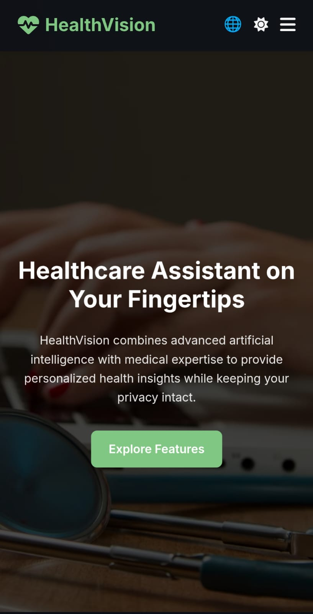

# 🏥 HealthVision - AI-Powered Healthcare Companion

> **Team Members:**  
> 👨‍💻 Yash Kumar  
> 👨‍💻 Mohammad Ubaid  
> 👨‍💻 Utkarsh Raj  
> 👨‍💻 Yashasvi Tripathi  

---

## 📚 Table of Contents
- [📖 Introduction](#-introduction)
- [✨ Features](#-features)
- [📂 Project Structure](#-project-structure)
- [🛠️ Technologies Used](#-technologies-used)
- [🚀 How to Run the Project](#-how-to-run-the-project)
- [🖼️ Screenshots](#-screenshots)
- [🌟 Future Improvements](#-future-improvements)

---

## 📖 Introduction
**HealthVision** is an AI-driven web platform that offers a comprehensive healthcare assistant.  
From symptom checking to appointment booking, and medical image diagnosis to finding nearby hospitals — HealthVision is designed to be your **smart healthcare companion**.

---

## ✨ Features
- 🩺 **Symptom Checker** — Analyze your symptoms and get possible health conditions.
- 📅 **Appointment Booking** — Set doctor appointment reminders with notification options.
- 💊 **Medication Consultancy** — Set up medication alerts to manage prescriptions.
- 📞 **Medication Reminder Calls** — Automated voice call reminders at scheduled times via Twilio.
- 📩 **SMS Notifications** — Send SMS alerts to registered family members via Twilio.
- ✉️ **Email Reminders** — Send appointment confirmation and hospital suggestions to users via EmailJS.
- 🖼️ **Image Diagnosis** — Upload and analyze medical images for preliminary insights.
- 📄 **Report Summarizer** — Upload PDF or image reports and get concise summaries.
- 🏥 **Nearby Hospitals Finder** — Locate hospitals around your current location.
- 🌗 **Dark Mode Support** — Smooth theme switching for user comfort.

---

## 📂 Project Structure
\`\`\`bash
.
├── index.html                 # Home page
├── symptom-checker.html        # Symptom checker page
├── appointment-booking.html    # Appointment booking page
├── consultancy.html            # Medication consultancy page
├── image-diagnosis.html        # Image diagnosis tool
├── report-summarizing.html     # Report summarizer page
├── nearby-hospitals.html       # Nearby hospital finder
└── assets/                     # (External assets loaded via CDN)
\`\`\`

---

## 🛠️ Technologies Used
- **Frontend:**  
  - HTML5  
  - CSS3 (including custom themes)  
  - JavaScript (Vanilla)

- **Libraries and Tools:**  
  - [Flatpickr.js](https://flatpickr.js.org/) — For date/time picking
  - [Tesseract.js](https://tesseract.projectnaptha.com/) — OCR from images
  - [PDF.js](https://mozilla.github.io/pdf.js/) — PDF file parsing
  - [Leaflet.js](https://leafletjs.com/) — Interactive maps
  - [FontAwesome](https://fontawesome.com/) — Icons
  - [Google Fonts (Inter)](https://fonts.google.com/specimen/Inter)
  - [Twilio API](https://www.twilio.com/) — For voice call and SMS medication reminders
  - [EmailJS (MailJS)](https://www.emailjs.com/) — For sending appointment and hospital information emails

- **External APIs:**  
  - Geolocation API (for hospital finder)  
  - Map tiles API (OpenStreetMap via Leaflet)

---

## 🚀 How to Run the Project
1. **Download** or **Clone** this repository.
2. Ensure you have an **active internet connection** (for external libraries and services).
3. Open the `index.html` file directly in your web browser (preferably Chrome, Firefox, or Edge).
4. Navigate easily through the Navbar.

✅ No local server or backend setup needed for the frontend!  
(Backend services like Twilio & EmailJS are triggered externally.)

---

## 🖼️ Screenshots

| Page | Screenshot | Description |
| :--- | :--- | :--- |
| Home Page |  | Homepage introducing HealthVision |
| Features Page |  | Features Page 1 |
| Features Page |  | Features Page 2 |
| Symptom Checker |  | Analyze and diagnose symptoms |
| Appointment Reminder |  | Book and manage appointments |
| Medication Reminder (Call/SMS) |  | Call/SMS medication reminders via Twilio |
| Email Reminder |  | Analyze your Medical Report |
| Image Diagnosis |  | Upload and analyze medical images |
| Hospital Finder |  | Locate nearby hospitals with map support |

---

## 🌟 Future Improvements
- 🔗 Enhance AI models for deeper medical analysis.
- 🧠 Implement machine learning-based diagnosis.
- 🔒 Add user accounts and secure authentication.
- 🗣️ Fully implement multilingual support.
- 📱 Make it a full **Progressive Web App (PWA)** for offline support.

---

## 🙏 Thank You!
> _Empowering healthcare with technology - anytime, anywhere._  
> Stay healthy, stay smart! 💚  
